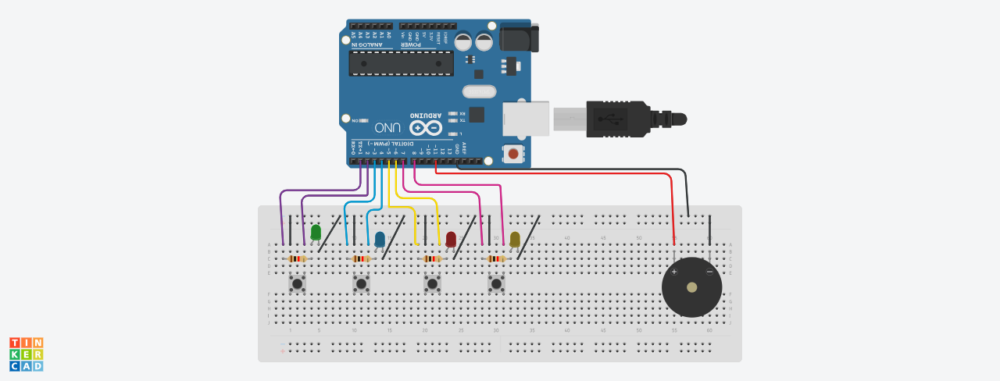

# Memory Game with Arduino

This project is a **Memory Game** developed with the **Arduino** platform. The aim of the game is to help players improve their memory skills by memorizing and reproducing an increasingly complex sequence of lights and sounds.

## 📦 Components Used

- 1x Arduino Uno
- 4x LEDs (red, green, blue, yellow)
- 4x Push-button switches
- 1x Buzzer
- 220Ω resistors for the LEDs
- Breadboard and jumpers

## 📐 Circuit

The circuit consists of four LEDs and four buttons, where each LED corresponds to a button. The player must follow a random sequence of LEDs that is displayed by pressing the corresponding buttons in the same order.

### Basic Connection Diagram:

## 🕹️ How to Play

1. When the game starts, the Arduino will light up a sequence of LEDs.
2. The player must press the corresponding buttons in the same order.
3. If the player gets the sequence right, a new sequence will be shown, adding an additional step.
4. The game continues until the player fails to follow the sequence, ending the game.

## 🤝 Contributions
Contributions, issues, and pull requests are welcome! For major changes, please open an issue first to discuss what you would like to change.